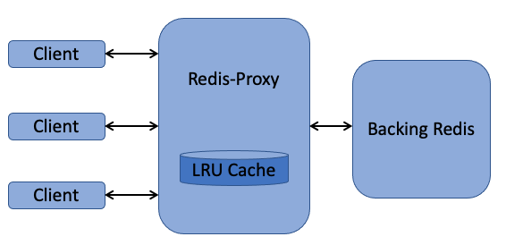

# Redis-Proxy implementation in Python using Tornado Web framework

## High-level Architecture Overview:

Below diagram depicts the high-level overview of Redis-Proxy.



### Components:
#### Clients:
Clients communicate with Redis-Proxy using `HTTP GET` to fetch the value of required keys

Example:

     ```
     # if the specified key is present in Redis-Proxy
     curl  http://localhost:8989/9
     {"value": "redis-proxy", "source": "local", "status_code": 200}

     # if the specified key is not present in Redis-Proxy
     curl  http://localhost:8989/9
     {"value": null, "source": "redis", "status_code": 404}
     ```

#### Redis-Proxy:
Redis-Proxy is implemented in this project.
- Redis-Proxy runs in docker container and caters to the client GET requests
- Its implemented using the Tornado web framework
- Redis-Proxy uses Tornado's IO event loop and asynchronous, non-blocking co-routines
- Proxy listens on a configurable address and port for the client requests
- Redis-Proxy maintains a connection to the the Backing-Redis
- Redis-Proxy maintains an internal LRU cache and first does a lookup into this local cache
- If the local cache look-up fails, Redis-Proxy then fetches the value from Backing-Redis
- Redis-Proxy can parallely serve multiple clients upto a configurable maximum limit
- Proxy uses Python's `RLock` for thread synchronization while accessing the shared cache

```
   Code:
   - main.py
   - src/handlers.py
```

#### Redis-Proxy LRU Cache:
- Redis-Proxy maintains an internal LRU cache
- Cache capacity (maximum numbers of entries) is configurable
- On reaching the capacity limit, cache will evict the LRU item to make room for the new entry
- Each entry in cache has a globally configurable expiry time
- If a cache entry expires, its treated as not available in the cache
```
  Code:
  - src/singleton.py
  - src/cache.py
```
##### Algorithmic Complexity for LRU Cache operations
- LRU Cache is implemented using Python's standard `OrderedDict`
- Time Complexity to get, set, delete and move operations of `OrderedDict` is O(1)
- Each entry of the LRU cache has its own expiry time and there is no associated additional complexity

#### Backing-Redis:
- Backing-Redis is actual Redis instance running behind Redis-Proxy
- Its a standard containerized Redis downloaded from Docker Hub


### Configuration
- `.env` file with-in the project can be used to configure Redis-Proxy
- At startup, `docker-compose` with-in the `Makefile` uses the `.env` file and passes the configuration
   parameters to Redis-Proxy as environment variables
- Below are the parameters that can be configured from `.env` file along with the default values
```
# Address on which the Redis-Proxy will listen
PROXY_PORT = 8989
PROXY_IP = 'redis_proxy'

# Address of the Backing-Redis
REDIS_SERVER_IP = 'redis'
REDIS_SERVER_PORT = 6379

# LR Cache cache size and global expiry time for cache entries
CACHE_EXPIRY = 3600
CACHE_CAPACITY = 1500

# Maximum number of client requests that can be handled parallely
MAX_CONCURRENT_REQUESTS = 11
```

### End-to-End System Tests
- This project contains a set of end-to-end systems tests that can be run against the Redis-Proxy
- Individual system test cases are written using Python's `unittest` framework
- When invoked, a new container gets launched and runs the system tests using `pytest`
- A report of the system tests results is presented on the console
- Separate `docker-compose` file is used to run the system tests
- Separate configuration parameters from `.env_system_tests` are used to run the system tests
```
  Code:
  - system_tests/tests/base.py
  - system_tests/tests/test_connections.py
  - system_tests/tests/test_proxy.py
  - system_tests/tests/test_cache.py
```

### Instructions to run the Redis-Proxy and system tests
- To run Redis-Proxy and Backing-Redis
```
  - git clone https://github.com/subhakarks/redis-proxy.git
  - cd redis-proxy
  - make start
    - Starts Redis-Proxy and Backing-Redis in Docker containers
  - make stop
    - Stops Redis-Proxy and Backing-Redis
```

- To run Redis-Proxy end-to-end system tests
```
  - https://github.com/subhakarks/redis-proxy.git
  - cd redis-proxy
  - make test
    - Starts containers for Redis-Proxy, Backing-Redis and System Tests
    - Runs system tests and prints results on console
  - make test-stop
    - Stops all the containers
```
#### Platform Requirements
- BASH
- GNU Make
- Docker version 20.10.13 or above
- Docker Compose version 2

### Time Spent
- Initial project environment setup: 3 hours
- Development of Tornado Application: 1 hour
- Design and development of handlers: 2 hours
- Design and development of LRU RedisCache: 2 hours
- Design and development system tests: 2 hours
- Documentation: 1 hour

### Omitted Requirements:
- Redis Client Protocol between Redis-Proxy to Backing-Redis due to lack of time
  #### Known Issues and Caveats
  - Issues while reading `MAX_CONCURRENT_REQUESTS` from environment while creating `ThreadPoolExecutor` in `handlers.py`
  - Hence reading `MAX_CONCURRENT_REQUESTS` from `settings.py`
